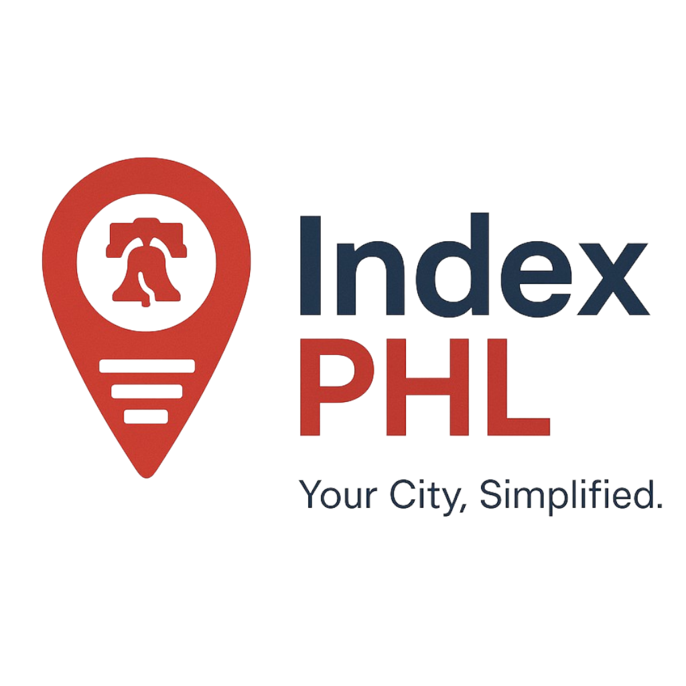

# IndexPHL


**Your Guide to Navigating Philly, One Resource at a Time**

[Watch the Demo Video](https://www.youtube.com/embed/YDASd6kd8J8?si=-f6b5JowM_czbh7w)

 

## Project Description

IndexPHL is designed as an AI-powered civic guide to help Philadelphia residents, particularly newcomers and underserved communities, quickly find essential local resources such as food assistance, housing options, healthcare services, transportation information, and more. Our goal is to consolidate scattered information from sources like OpenDataPhilly into a simple, accessible, and searchable platform.

## Problem & Solution

**🚨 Problem:** Navigating the array of local resources in Philadelphia can be overwhelming, confusing, and time-consuming. Crucial information is often fragmented across various websites, outdated documents, or hard-to-navigate portals, making it difficult for residents, especially those new to the city or facing crises, to access the help they need.

**💡 Solution:** IndexPHL provides a user-friendly, centralized platform with a simple search interface, categorized Browse, and planned multilingual support. By pulling data into one searchable index, we aim to empower residents to find critical services efficiently and without unnecessary barriers.

## Minimum Viable Product (MVP) Features

Our MVP focuses on the core functionality of finding resources:

* **Categorized Directory:** Browse resources organized into key categories (Housing, Food, Health).
* **Search Functionality:** Search for resources using keywords. The MVP uses local demo data (`data/search.json`) with autocomplete suggestions and navigates to a dedicated results page.
* **Dynamic Results Page:** Displays search results in a clear list format.
* **Basic Translation (using gt-next):** Support for multiple languages (English, Spanish, Ukrainian) with a language toggle in the Navbar. This is implemented using the `gt-next` library and relies on the General Translation service and CDN for managing and serving translations.

## Tech Stack

* **Frontend:** React, Next.js (App Router)
* **Styling:** Tailwind CSS
* **Internationalization:** `gt-next` (integrates with General Translation service)
* **Data Source (Concept):** OpenDataPhilly (MVP uses local demo data `data/search.json`)
* **AI (Concept):** Planned for search and assistant features (not fully implemented in this MVP version).

## Setup and Installation

To get a copy of the project up and running on your local machine:

1.  **Clone the repository:**
    ```bash
    git clone [https://github.com/RuslanTsykaliak/INDEX-PHL.git](https://github.com/RuslanTsykaliak/INDEX-PHL.git)
    cd INDEX-PHL
    ```

2.  **Install dependencies, including gt-next:**
    ```bash
    npm install
    ```

3.  **Initialize General Translation (gt-next):**
    Run the GT CLI wizard to configure the `gt-next` library for your project, set up locales (en, es, uk), and link to the General Translation service. This will create `gt.config.json` and modify other files. Follow the prompts carefully, selecting your desired languages.

    ```bash
    npx gtx-cli@latest init
    ```

4.  **Obtain and Set API Keys:**
    The GT wizard will guide you through generating or linking API keys and a project ID. You will need both **development** and **production** keys/IDs from your General Translation dashboard. Set these as environment variables in `.env.development` and `.env.production` in the project root.

    ```env
    # .env.development
    GT_API_KEY=YOUR_DEVELOPMENT_API_KEY
    GT_PROJECT_ID=YOUR_DEVELOPMENT_PROJECT_ID
    ```

    ```env
    # .env.production
    GT_API_KEY=YOUR_PRODUCTION_API_KEY
    GT_PROJECT_ID=YOUR_PRODUCTION_PROJECT_ID
    ```
    (Replace placeholders with your actual keys and IDs. Ensure these are not committed to Git).

5.  **Manage Translations:**
    Use the General Translation dashboard or CLI tools to find the source strings from your code (content inside `<T>` tags), generate translations (potentially using their AI service), review them, and **publish** them to the CDN for both development and production environments. Translation will not appear in your app until this step is completed and translations are published.

## How to Run the Project

* **Development Mode:**
    ```bash
    npm run dev
    ```
    Open [http://localhost:3000](http://localhost:3000) in your browser.

* **Build for Production:**
    ```bash
    npm run build
    ```
    (Requires production API keys set in `.env.production` and translations published for production).

* **Start Production Server:**
    ```bash
    npm start
    ```
    (Run this after a successful build).

## How to Use the Application (MVP)

1.  Navigate to the Home page (`/`).
2.  Use the search bar to find resources by typing keywords (e.g., "food", "shelter", "clinic"). Suggestions may appear as you type. Press Enter or click Search to go to the results page.
3.  On the Results page (`/results`), view the list of resources matching your query.
4.  Use the category cards on the Home page to navigate to the Categories page (`/categories`).
5.  On the Categories page, see the list of main resource categories. (Links on this page go to category-specific pages, which might be placeholders in the MVP).
6.  Use the language toggle in the Navbar to switch between English, Spanish, and Ukrainian. Note that translations will only appear if they have been completed and published via the General Translation platform.

## Future Enhancements

* Integration with real data sources (e.g., OpenDataPhilly API).
* Fully functional Interactive Map displaying resource locations based on search results or category.
* AI-Powered Smart Search and AI Assistant for natural language queries.
* More detailed resource information pages.
* Ability for users to submit new resources.
* Support for more languages.
* Improved UI/UX design.

## Team

* Lillian Gil
* Ruslan Tsykaliak
